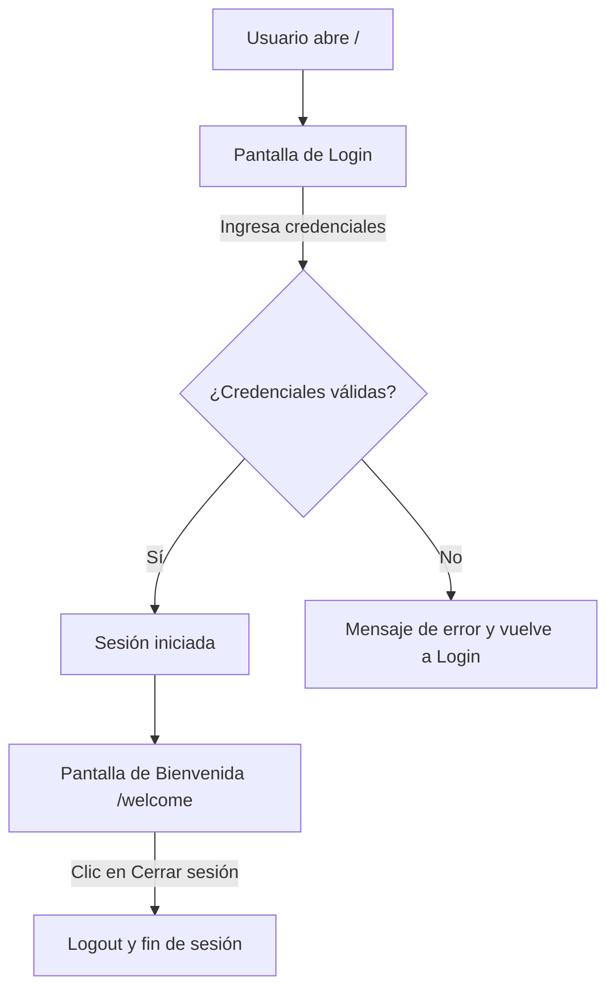

## 📝 Demo de Login Flask — Guía para Devs Junior



### ¿Qué es este proyecto?
Una app web simple hecha con Flask (Python) que permite iniciar sesión usando usuarios de prueba guardados en memoria. No usa base de datos ni archivos externos.

---

## 🚀 ¿Cómo lo ejecuto?

1. **Clona el repositorio**
	```powershell
	git clone <URL_DEL_REPO>
	cd RepoPython3
	```

2. **Crea un entorno virtual e instala dependencias**
	```powershell
	python -m venv .venv
	.\.venv\Scripts\Activate.ps1
	pip install -r requirements.txt
	```

3. **Ejecuta la app**
	```powershell
	python app.py
	```
	La app estará disponible en [http://localhost:5000](http://localhost:5000)

---

## 👤 Usuarios de prueba

Puedes iniciar sesión con cualquiera de estos:

| Email             | Contraseña  | Nombre         |
|-------------------|-------------|---------------|
| admin@test.com    | admin123    | Administrador |
| user@test.com     | user123     | Usuario       |
| demo@demo.com     | demo        | Demo User     |

---

## 📂 Estructura principal

- `app.py` — Lógica principal, rutas y usuarios.
- `templates/` — HTML (login y bienvenida, en español).
- `static/style.css` — Estilos visuales.
- `requirements.txt` — Solo depende de Flask.

---

## 🛠️ Notas para desarrolladores

- Si editas los templates, usa `{{ url_for('static', filename='style.css') }}` para los CSS (no rutas absolutas de Windows).
- El login es solo demostrativo: los usuarios están en memoria, no hay base de datos.
- Los mensajes de error y bienvenida se muestran como "toast" (notificaciones flotantes).
- El secreto de sesión (`app.secret_key`) está fijo en el código, **no usar así en producción**.

---

¿Dudas o quieres mejorar algo? ¡Haz un PR o abre un issue!
